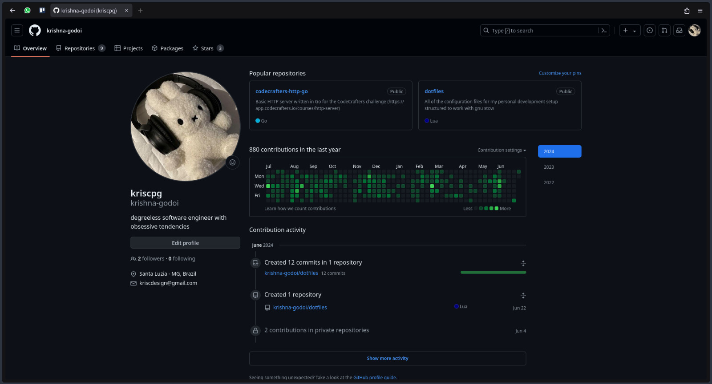

## Goal: make it clean.
The goal of the config is to maximize the available vertical space without needing to switch to a vertical bar layout. The layout is pretty much [minifox](https://codeberg.org/awwpotato/MiniFox) with some modifications to make the urlbar more usable.

### Result 

### Installation 
1. Move the contents of the `firefox` directory in [this repo](https://github.com/Aris-t2/CustomJSforFx/tree/master?tab=readme-ov-file#script-loader) to the firefox application directory *(about:profiles > "Local directory")*    
2. Move the the `chrome` directory and the `user.js` file into the firefox profile directory. *(about:profiles > "Root directory")*    
3. Right click the urlbar and go to `Customize Toolbar...`, then drag off all of the elements you don't want in your bar    
4. Customize the colors using [firefox color](https://color.firefox.com). Note that some of the colors were hardcoded cause I was too lazy to look for the correct browser variables. You can change those colors in the CSS files inside the `chrome` directory.    

### Shortcuts 
There were two main issues I wanted to solve in the original minifox config:
- There was no way to access the urlbar with the mouse.
- The escape key doesn't close the urlbar (this is firefox's fault)

So I added some JS scripts to handle that behavior and add:    
<kbd>Escape</kbd>: To close the urlbar (as it should always have been)    
<kbd>Double click tab</kbd>: Open the urlbar    

And of course, we still have the regular keyboard shortcuts for using firefox without a mouse:    
<kbd>Ctrl</kbd> + <kbd>L</kbd>: Show and focus the urlbar    
<kbd>Ctrl</kbd> + <kbd>K</kbd>: Show and focus the urlbar in search mode    
<kbd>Ctrl</kbd> + <kbd>T</kbd>: Open new tab    
<kbd>Ctrl</kbd> + <kbd>W</kbd>: Close current tab    

### Design philosophy
Decisions were made with my specific use cases in mind. Here are a few of the considerations:    
**Keyboard navigation is great, but sometimes you just want to use the mouse.**
*(E.g when eating dinner and scrolling youtube)*    
- Back button is preserved since I don't have a back buttton on my mouse. Feel free to remove it (or add back the forwards button) by editing the `main.css` file in the `chrome/browser` dir.
- Urlbar is removed instead of placed in line with the tabs, as in some of the other one-liner setups. I still want to be able to change the tab URL with the mouse, hence the JS handlers for showing urlbar on tab double click.
- Kept the new tab button around, but it can be removed by right clicking the urlbar > Customize Toolbar... > Drag the new tab button out of the bar.
